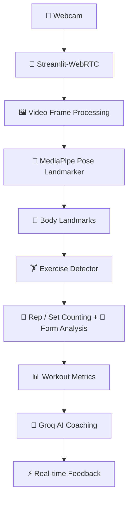

# 🏋️‍♀️ AI Real-time GYM Coach

### *Turning a webcam into your personal AI fitness coach*

  
  
  
  
  
  

**🎥 Real-time Pose Detection &nbsp;•&nbsp; 🔢 Rep & Set Tracking &nbsp;•&nbsp; 📐 Form Analysis &nbsp;•&nbsp; 🗣️ AI Voice Coaching**

 

&nbsp;

---

## 📖 About

**AI Real-time GYM Coach** is a computer-vision fitness application that turns a webcam into an interactive personal trainer.

It detects body landmarks in real time, understands exercise movements, counts repetitions and sets, checks your form, and delivers AI-powered coaching feedback, all from your browser.

---

## ✨ Key Features

| | Feature | Description |
|:-:|---|---|
| 🎥 | **Real-time Pose Detection** | Powered by MediaPipe Pose Landmarker |
| 🔢 | **Automatic Rep & Set Counting** | Hands-free tracking as you train |
| 🏋️ | **5 Supported Exercises** | Squats, Push-ups, Biceps Curls, Shoulder Press & Lunges |
| 📐 | **Exercise-specific Form Analysis** | Uses joint angles and pose landmarks |
| 🗣️ | **AI Coaching Feedback** | Powered by the Groq API |
| 📹 | **Live Webcam Processing** | Streamlit-WebRTC streaming |
| 📊 | **Workout History & Tracking** | Review your performance over time |
| 🌐 | **Browser-based Interface** | Interactive UI built with Streamlit |

---

## 🏋️ Supported Exercises

| Exercise | What It Tracks |
|---|---|
| 🦵 **Squats** | Knee-angle depth detection, rep counting, back-angle monitoring |
| 💪 **Push-ups** | Body alignment, hip position, rep counting |
| 🦾 **Biceps Curls** | Arm movement, swing detection, rep counting |
| 🙌 **Shoulder Press** | Arm extension, back-arch monitoring, rep counting |
| 🏃 **Lunges** | Leg movement, balance monitoring, rep counting |

---

## 🧠 How It Works

> 💡 Each exercise has its own detector. The detector uses body landmarks and movement thresholds to determine the exercise stage and count completed repetitions.

---

## 🤖 AI Coaching

The application connects exercise events and detected metrics to the **Groq API** for contextual coaching feedback, including:

- ✅ Ongoing form checks
- 🏁 Completed sets
- 🎉 Completed workouts
- ⚠️ No-pose warnings

> The AI layer works **alongside** the computer-vision system rather than replacing pose detection.

---

## 🛠️ Tech Stack

| Technology | Purpose |
|---|---|
| 🐍 **Python** | Core application and exercise logic |
| 🧍 **MediaPipe** | Real-time human pose and landmark detection |
| 👁️ **OpenCV** | Image/video processing and visualization |
| 🔢 **NumPy** | Numerical and landmark calculations |
| 🌐 **Streamlit** | Interactive web application |
| 📡 **Streamlit-WebRTC** | Real-time webcam/video streaming |
| 🎞️ **PyAV** | Video frame handling |
| 🧠 **Groq API** | AI-powered coaching responses |
| 🗄️ **SQLite / Persistence Layer** | Workout and exercise history |

---

## 🚀 Try the Project

| 🏋️ Live App | 🌐 Landing Page |
|:-:|:-:|
| **[Try AI Real-time GYM Coach](https://ai-gym-coach-aayesha.streamlit.app/)** | **[Visit the Landing Page](https://ai-gym-coach-landing-page.netlify.app)** |

---

## 🎯 Project Focus

**Computer Vision &nbsp;+&nbsp; Generative AI &nbsp;+&nbsp; Real-time Video Processing**

This project combines **pose estimation, computer vision, real-time streaming, exercise-specific algorithms, workout tracking, and LLM-powered coaching** into a practical AI fitness application.

---

### 👩‍💻 Built with Python 

**AI Real-time GYM Coach: Turning a webcam into an AI fitness coach.**

⭐ *If you like this project, consider giving it a star!* ⭐

